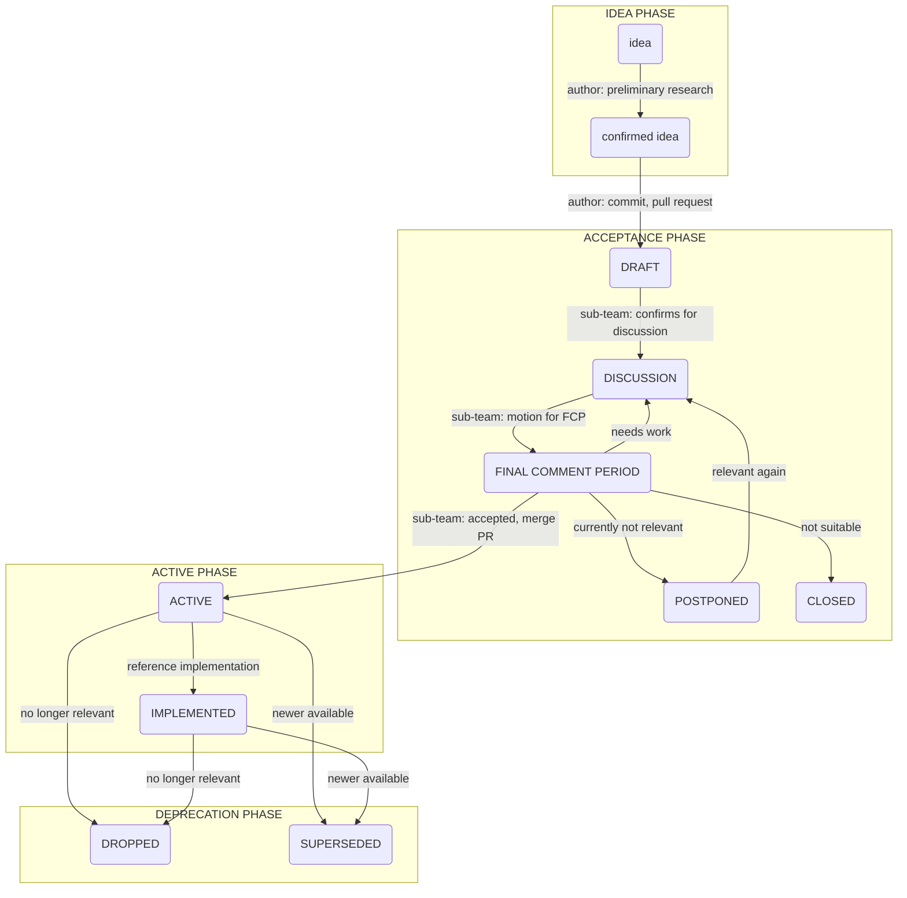

# Fair Data Protocol Improvement Proposal Lifecycle

```mermaid
graph TD


subgraph IDEA PHASE
    -1(idea)

    0(confirmed idea)
end

subgraph ACCEPTANCE PHASE
    a(DRAFT )

    b(DISCUSSION)

    c(POSTPONED)

    d(FINAL COMMENT PERIOD)

    e(CLOSED)
end

subgraph ACTIVE PHASE
    f(ACTIVE)

    g(IMPLEMENTED)
end

subgraph DEPRECATION PHASE
    h(DROPPED)

    i(SUPERSEDED)
end


-1 -- author: preliminary research --> 0

0 -- author: commit, pull request -->a

a -- sub-team: confirms for discussion --> b

b -- sub-team: motion for FCP --> d

d -- not suitable --> e

d -- currently not relevant --> c

d -- sub-team: accepted, merge PR --> f

f -- reference implementation --> g

f -- no longer relevant --> h

g -- no longer relevant --> h

f -- newer available --> i

g -- newer available --> i

d -- needs work --> b

c -- relevant again --> b

```
