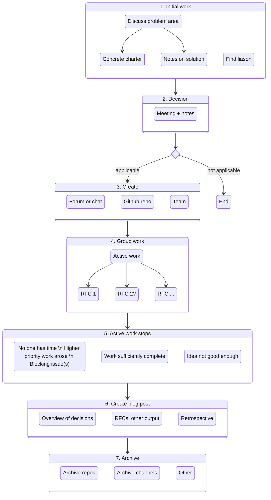

# Fairdrive Improvement Proposal (FIP) process diagram

```mermaid
stateDiagram-v2 
%% define states
1: 1. Initial work
2: 2. Decision
state is_applicable <<choice>> 
3: 3. Create
4: 4. Group work
5: 5. Active work stops
6: 6. Create blog post
7: 7. Archive

%% Initial work
state 1 {
1.1: Discuss problem area
1.2: Concrete charter
1.3: Notes on solution
1.4: Find liason
}

%% Decision
state 2 {
2.1: Meeting + notes
}

%% Create
state 3 {
3.1: Forum or chat
3.2: Github repo
3.3: Team
}

%% Group work
state 4 {
4.1: Active work
4.2: RFC 1
4.3: RFC 2?
4.4: RFC ...
}

%% Active work stops
state 5 {
5.1: No one has time \n Higher priority work arose \n Blocking issue(s)
5.4: Work sufficiently complete
5.5: Idea not good enough
}

%% Publish results
state 6 {
6.2: Overview of decisions
6.3: RFCs, other output
6.4: Retrospective
}


%% Archive
state 7 {
7.1: Archive repos
7.2: Archive channels
7.3: Other
}


%% connect states in process

1 --> 2
1.1 --> 1.2
1.1 --> 1.3

2 --> is_applicable
is_applicable --> End: not applicable
is_applicable --> 3: applicable

3 --> 4

4.1 --> 4.2
4.1 --> 4.3
4.1 --> 4.4

4 --> 5

5 --> 6

6 --> 7


```