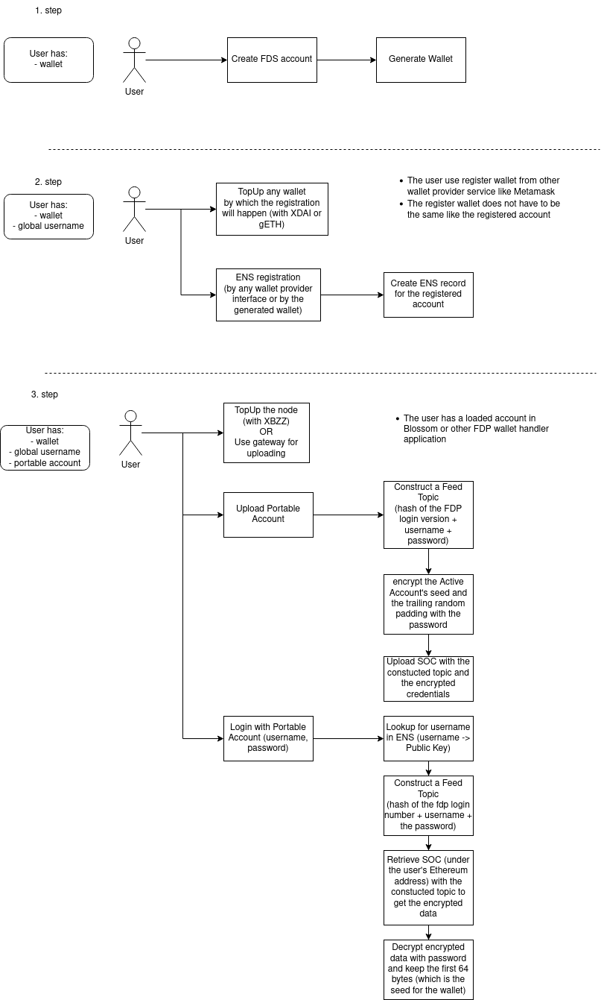

- FIP: 59
- title: Portable Account
- author: Viktor Levente Tóth, @nugaon
- status: draft
- created: 2022-10-04

# Summary
Addressing web3 login workflow where users can retreive their wallet in a decentralized manner from anywhere by providing a _username_ and a _password_.

# Context, motivation and guide level explanation
A wallet is an assymetric keypair that represents an account in Ethereum or in Fair Data Society.
Usually, the private key is stored in the local storage of a wallet provider (such as Metamask or Blossom extension) or in a hardware wallet (such as Ledger).

The solution worked out here allows to log in to the user account from any device in the same way like in case of Web2: providing a username and a password.
Such a login can happen in a fully decentralized way using only Ethereum Name Service (ENS) and Ethereum Swarm.

This facilitates using the same wallet in different wallet handler applications (e.g. Blossom and FDP CLI), moreover, it allows to use the account from any device without the need of a pendrive or a hardware wallet.

# Reference-level explanation
The reference implementation can be found in [FDP Storage JS library](https://github.com/fairDataSociety/fdp-storage) in the `src/account` folder.

The portable account creation happens in 3 steps:
- Wallet generation
- ENS registration (username->public key)
- portable wallet (wallet seed) upload to Ethereum Swarm

The steps are detailed in the following figure



## Calculating the location of the portable account
The ENS is used to map usernames to public keys. From the public key, the account's ethereum address can be derived easily for everyone.
The Ethereum address is needed to contruct Single Owner Chunk (SOC) address along with a consensual 32 bytes of Topic.
The login workflow defines the exact SOC Topic construction:

```
socTopic = H(fdpLoginVersion + username + password)
```

Where the parameter is consist of concatenated strings, the hash function is `keccak256` and the current `fdpLoginVersion` is `FDP-login-v1.0`.
With this, the encrypted seed address on the Swarm network can be calculated, formally

```
socAddress = H(socTopic + ethereumAddress)
```

Thereby, only the user (or who knows the credentials) can calculate the Swarm Hash (`socAddress`) where the encrypted seed of the wallet will be located.

## Wallet seed encryption
The seed is 64 bytes that is used to initialite an HD wallet. The keypair that represents the user account can be derived from HDPath `m/44'/60'/0'/0/0`.
The seed will be padded with random data with byte length `CHUNK_SIZE - SEED_SIZE - IV_LENGTH = 4016`.
The resulted data will be encrypted with AES, where the encryption key is the SHA256 hash of the password.

By this, the encrypted data will reserve a whole chunk (4KB) with random data without structure, where the first 64 bytes are the encrypted wallet seed.

## Maintenance of the portable account
The portable wallet is uploaded to Swarm by a postage stamp, that defines an estimated lifetime for the data on the network. 
After this time, the data will be garbage collected.
Because the portable account can disappear from the network:
- the portable accounts should be saved locally after login (with proper encryption),
- the portable account upload (the 3rd step from Figure 1) has to be provided for an already existing username as well

When such a reupload happens, the active account's public key should match with the registered public key under the given username in ENS.

# Drawbacks
Users are able to upload the same wallet seed with a different password. Data cannot be removed from the network, thereby, they can log in to one user account with different passwords if once they have done so.

# Fair Data Principles alignment
This proposal facilitates the web3 onboarding of users by providing a workflow that they got used to on web2 regarding account handling.

# Prior art
- [Single Owner Chunks: 2.2.3 - Book of Swarm](https://www.ethswarm.org/The-Book-of-Swarm.pdf)
- [Advanced-Encryption-Standard (AES) - Corinne Bernstein & Michael Cobb](https://www.techtarget.com/searchsecurity/definition/Advanced-Encryption-Standard)
- [Official ENS documentation](https://docs.ens.domains/)

# Unresolved questions
_TBD_

## Copyright

Copyright and related rights waived via [CC0](https://creativecommons.org/publicdomain/zero/1.0/).
