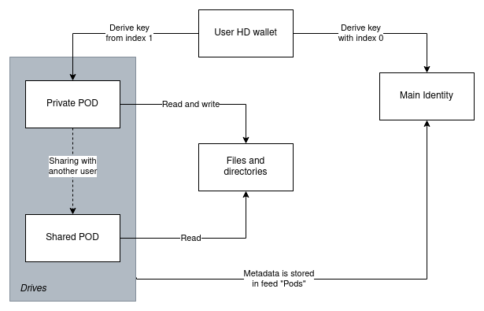

- FIP: 61
- title: Personal Storage
- author: Viktor Levente Tóth, @nugaon
- status: draft
- created: 2022-11-14

# Summary
One of the most obvious uses of a storage service is to store files in folders under a user profile.
On a public storage network, the data that belongs to the user must be encrypted, access controlled, structured and mountable.
The detailed solution below derives the Personal Storage of the user from their wallet and allows to create multiple drives that can be shared with other users for reading its content.

# Context, motivation and guide level explanation
Services like Dropbox, Google Drive or Microsoft OneDrive provide storage capacity for users that is mountable to their filesystem and it can be accessible only to the owner or can be shared with other users.

The Personal Storage concept of FDP aims at the same functionality but operates on decentralized storage networks as well.
In addition, the solution elaborated here has automatic versioning on the uploaded data.

A hierarchical deterministic wallet (HD walet), from which multiple asymmetric key pairs can be derived, represents a single user account.

Each derived key acts as a _POD_ in this concept which can be seen as a _drive_ for storing personal data.
The PODs have their own Identity Anchored Address Space (IAAS) within which directories and files can be referenced (for more information read [IAAS document](./0013-iaas.md)).
Because PODs have different keys signing the content, one cannot associate PODs to a user account - unless the user wants to do that.

DApps can only interact with individual PODs of the user preventing reading more information than needed.
Nevertheless, there must be trusted DApps that manage all PODs of the user so that user can remove/list/add PODs of its Personal storage.
Such trusted dApps are:
- Fairdrive
- FairOS
- FDP-CLI

Every data is encrypted in the Personal Storage where each POD has their own encryption key stored in the IAAS of the _Main Identity_.
The Main Identity is the first derived key of the HD wallet, therefore, every subsequent derived key (POD) is the _subentity_ of the user.

There is possibility to create a _shared POD_ which is a derived key from one of the parties.
The public key of the shared POD can be shared along with the key used for encryption with another user in order to read data.
Optionally, the file structure of a shared POD can be merged with another POD for listing directories or files, thereby, mimicking a multi-user file system.



The versioning is achieved by using Epoch-based Swarm Feeds that allows sporadic updates under a topic.
The updates are achored to the time so one can find the nearest update of a given point in time.
In the feed payloads, all related metadata can be found for files and folders such as its type, name, creation data, etc.
_For more information about Epoch-based feeds, read the Book of Swarm (1.0) at 4.3.4 chapter._

# Reference-level explanation
The reference implementation of the Personal Storage can be found in the [fdp-storage](https://github.com/fairDataSociety/fdp-storage) JS library.

## Main Identity
The Main Identity is the first derived address in the HD wallet. 
Its derivation path is `m/44'/60'/0'/0/0` but _optionally_ clients can support multiple account handling with incrementing the 3rd `Account` parameter such as `m/44'/60'/1'/0/0` for the second account derived from the seed.

This address is used to make blockchain transactions and manage PODs meanwhile other addresses (PODs) only do off-chain operations for example Swarm Feed signing for dApps.

## POD
All POD have a `name` property in order to refer that with a human-readable string.
Each POD type has additional attributes required to initialize the drive in question.

The private POD is a derived keypair from the HD Wallet on path `m/44'/60'/0'/0/${index}` where `${index}` starts from `1` and it is incremented by creating a new POD.
This index has to be stored along with a 32 bytes of encryption key called `password` with which all metadata will be encrypted in a POD.
```ts
interface PrivatePod {
  name: string
  password: Bytes<32>
  index: number
}
```

One can share their private POD that becames a Shared POD.
For that, a shared link is created that the other user can insert to their POD list. 
It contains the before mentioned `password` and the Ethereum Address of the POD.
Latter is needed to query the Feed Updates of the POD.
All together, a Shared POD structure looks like the following

Shared POD
```ts
interface SharedPod {
  name: string
  password: Bytes<32>
  address: EthAddress
}
```

### Serialization
The serialization of these pods in the `PODs` consensual topic is
```ts
interface PodList {
  pods: { name: string, password: HexString, index: number }[]
  sharedPods: { name: string, password: HexString, address: HexString }[]
}
```
where the `PodList` is a stringified JSON object.
The `HexString` is a character encoded hexadecimal string without `0x` prefix.

This whole is encrypted with `AES` in CFB mode and with NOOP padding strategy.
The used key for encryption is the SHA256 hash of the private key of the Main Identity.

## Files and Folders
The files and folders have similar properties like Linux inodes.
The metadata must contain all attributes that make possible to mount the personal storage to the filesystem.

```ts
export interface FileMetadata {
  version: number // default is 2
  filePath: string
  fileName: string
  fileSize: number
  blockSize: number // 1000000 bytes by default
  contentType: string // MIME type
  compression: 'snappy' | 'gzip'
  creationTime: number
  accessTime: number
  modificationTime: number
  fileInodeReference: string // base64 encoded content address
}
```

One particular thing in storing the data is that the stored file can be splitted into `blocks` that can be referenced later individually.
For the block size, any arbitrary number can be chosen in byte resolution.
The `fileInodeReference` points to a JSON object that stores an array of blocks.

```ts
interface Block {
  size: number // information size of the block in bytes that has to be lesser or equal than `block_size`
  compressedSize: number // compressed data size in bytes
  reference: {
    swarm: string // base64 encoded content address
  }
}

interface FileInode {
  blocks: Block[]
}
```
These blocks are assembled when the download happens in the same order as it was set in the `blocks` array under the inode reference.

Every file belongs to one folder that lists up all other file and folder names under the same path:
```ts
interface Directory {
  meta: {
    version: number // default is 2
    path: string
    name: string
    creationTime: number
    modificationTime: number
    accessTime: number
  }
  fileOrDirNames: string[] | null
}
```
The `fileOrDirNames` and `modificationTime` metadata have to be updated after every Directory Item insertion and deletion.

The serialization of these JSON objects are the same as at POD: the objects first have to be stringified then UTF8 encoded into a byte array.
The serialized data is encrypted with the password of the related POD.

## Addressing
In order to address pods, files and directories, the concept leverages the Swarm Epoch-based Feeds.

Feeds are based on Single Owner Chunks that provides identity-based addressing for content where the identity-owner can refer data under an arbitrary 32 bytes of _identifier_.
The address is calculated by the keccak256 hash of this identifier and the Ethereum address of the identity.
If we split the identifier into a _topic_ - that has the very same purpose as the identifier - and to an index then we talk about Feeds.
The epoch-based feeds anchor the index to the time where the updates are sporadic but the queries are logaritmic.

The versioning comes from the feed indexing so that clients can calculate the identifier with an older epoch grid cell in order to get a previous state of a resource.

Topics are consensual in the Personal Storage.

To get the [POD related metadata](#pod), the used topic is the keccak256 hash of the string `PODs`.
The IAAS of this topic belongs to the [Main Identity](#main-identity).
By this, the public address of the Main Identity can be public since the POD related metadata can be only read by who posesses its private key. 
Only information that is exposed to outside is that the Main Identity has Personal Storage by querying the PODs topic.
Other consensual topics - that applications are using - should be in the IAAS of PODs.

After picking one POD to retreive files or directories, there is no much to do only keccak256 hashing of the `path` of the resource.
The path is a string where the delimeter is a `/` with which the path is also prefixed notating the root directory.
This hashed path will be the topic of the feed.

Because files have direct address to its metadata, the fetch of one file can work even if some of its parent directories disappeared from the storage network.
Nevertheless, keeping online and up-to-date directory metadata is important for having personal storage discovery about the stored files.  

## Workflow
Above detailed operations can be summarized like:

Uploading File

0. Choose POD where the metadata will be stored (POD list is available in the IAAS of the Main Identity)
1. Construct FileMetadata
2. Split file into blocks
3. Upload encrypted blocks
4. Construct inode metadata for blocks
5. Upload encrypted inode metadata
6. Write FileMetadata Feed where the topic is the path (e.g. `/path/to/the/file.md`)
7. Update the metadata of the corresponding parent directory (e.g. `/path/to/the`)

Downloading File

0. Choose POD where the metadata is stored (POD list is available in the IAAS of the Main Identity)
1. Get FileMetadata Feed where the topic is the path (e.g. `/path/to/the/file.md`)
2. Decrypt FileMetadata to access inode metadata reference
3. Download inode metadata and decrypt it in order to get block references
4. Download and decrypt block data
5. Assemble blocks and interpret it as the MIME type (stored in FileMetadata)

# Fair Data Principles alignment
Personal data handling should be fully open sourced and transparent respecting the users privacy.

This proposal provides a solution where the data is encrypted client-side and using decentralised storage service that prevents censorship of the user (based on their identity).
This allows the user to access anytime and anywhere to their personal storage using a single HD wallet.

DApps can interact with the user drives (PODs) that does not expose additional information what other type of data they store, still, it supports interoperability by Shared PODs.

# Prior art
- [BIP-44 - Multi-Account Hierarchy for Determenistric Wallets](https://github.com/bitcoin/bips/blob/master/bip-0044.mediawiki)
- [Book of Swarm v1.0 - 2.2.3 Single-owner chunks](https://www.ethswarm.org/The-Book-of-Swarm.pdf)
- [Book of Swarm v1.0 - 4.3.4 Epoch based indexing](https://www.ethswarm.org/The-Book-of-Swarm.pdf)
- [MIME types](https://en.wikipedia.org/wiki/Media_type)

# Unresolved questions
- Sharing directories and files without exposing POD source. It may need different and distinct encryption key usage for directories or files. 
- Tracing and managing granted permissions of Shared PODs (e.g. ACL/ACT functionality).
- The concept can be sorted out without using HD wallets since the encrypted POD list can store private keys as well. Nevertheless, it is a legacy feature of FairOS on which multiple applications are dependent, thereby, it is questionable to introduce such a breaking change since it does not cause any problem.
- the access time updates cannot be garanteed nor worth doing that since the uploads have costs in this environment.
- the stored files could be uploaded to any storage service since only the metadata handling is Ethereum Swarm specific in the architecture.

## Copyright
Copyright and related rights waived via [CC0](https://creativecommons.org/publicdomain/zero/1.0/).
