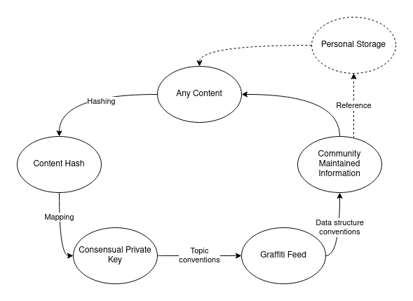

- FIP: 62
- title: Graffiti Feed
- author: Viktor Levente Tóth, @nugaon
- status: draft
- created: 2022-12-06

# Summary
Graffiti Feed is a serverless off-chain information and data-source signaling for dynamic decentralized applications.
It contains a list of records in the same structure that anyone can read and write using a consensus.
Using the below described architecture, parties can advertise some information to others under an arbitrary topic.
Based on the topic, it facilitates finding related unknown resources and actors that can be useful for many use-cases such as 
web3 forum, content labeling, initializing connection with others and else.

# Context, motivation and guide level explanation
All (dynamic) web applications communicate with central servers for various reasons from which the most prominent is to access and write a central database.

Users can upload data without permission onto a P2P storage network but labeling and grouping these content in a decentralized way can be challenging.

The most straightforward option would be to write some on-chain registry (smart contract) that stores all content addresses managed by users,
but this proposed solution offers a cheaper and faster off-chain workflow by leveraging [IAAS](./0013-iaas.md) (a.k.a Single Owner Chunks, Feeds).

The idea comes from that everything can be used as a private key since it is just a random, fixed-lengthed byte array to which any input can be hashed.
Generating this private key by consensus allows users to write into the same IAAS that other peers fetch in order to retrieve Community Maintained Information (CMI) of the associated resource.
The consensus can be outlined by a simple frontend application which has 0 maintenance expenditure still with dynamic properties.
It is possible because the users only interact with the decentralized storage and there is no backend server required to maintain the dynamic workflow.

This approach by itself is the most effective between parties to have on-demand decentralized information sharing.
E.g. Alice uploads a picture to the P2P storage network and send its content address to Bob. 
Bob can download this content, moreover, use the address as a private key that allows him to write a comment in its Graffiti Feed.
This feed written by the associated private key is fetched by other parties that want to retrieve CMI of the content in question.
Then Bob also sends this content address to Carol and Dave and they also can comment and distribute it further.
Next time when Alice queries the Graffiti Feed of her content, she will see new comments from unknown users.
The content address in question also can be advertised in a consensual Graffiti Feed for other unknown parties.

The process becomes not that effective when Carol writes data outside the consensual CMI structure (invalid data) to the Graffiti Feed.
In this case, the application has to ignore that update thereby slowing down the retrieval of valuable content for the other clients.
This issue can be elaminated by a web3 service that aggregates every well-formed updates, thereby also speeding up the retrieval time for fetching CMI, but that is not the scope of this FIP.

Eventually, a CMI can be any consensual data such as the content address advertisement or user-based contributions such as commenting as well.
For the latter, the preferred CMI record structure holds one or many IAAS identifiers (public key or ethereum address) which point to a storage area that only the participants can write possessing its corresponding private key (Personal Storage).
In other worlds, participants _advertise_ their storage area in particular Graffiti Feeds of content.
By that, the contributions are user-based that facilitate the aggregation of useful CMI.

Let's say, Alice did not know about Dave but she obtained his Personal Storage address from Graffiti Feeds related to content about cats.
Because she liked his contributions to cat topics, she adds his Personal Storage address to her list.
On the other hand, she did not like contributions from Carol, so she adds her to the block list.
The application used by Alice will always try to fetch cats related comments from all Personal Storage of these lists (which can be delegated to the before mentioned service aggregators).

Worth to mention, all contributions advertised in Graffiti Feed automatically provide a base for other Graffiti Feeds related to those contributions (e.g. comments on comments).



# Reference-level explanation
The original idea has its implementation similar that described below in the [AnyThread project](https://github.com/anythread/) and the concept can be tried out with the [ZeroDash JS library](https://github.com/anythread/zerodash)

The IAAS currently implemented in Ethereum Swarm by Single Owner Chunks.
The Graffiti and Personal Storage Feeds can be implemented as sequential Feeds in Swarm.
_For more information about feeds, read the Book of Swarm (1.0) at 4.3 chapter._

## Consensus

With the Consensual Private Key (CPK), sequential updates can be given by different users in its Feed.

To create a consensus the followings should be defined:
1. how to calculate the CPK,
2. interpretation of the metadata of the CMI (what properties one record must hold in what type),
3. an arbitrary topic in the IAAS of the CPK to store CMI and its Feed lookup algorithm (Graffiti Feed Topic),
4. (required only at user-based consensus) the topic conventions and metadata format in the Personal Storage of the users whose IAAS identifier appear in the Graffiti Feed.

Possible workflow for the points above:
calculate either the BMT address or hash of the common resource for `1`.
Both are 32 bytes that can be used directly as private key, let's choose `cpk = bmtAddress(content)`.

By designing the payload of Graffiti Feed `2`, the `4` point also can be prepared for which the IAAS identifier of the CMI contributor must be stored.
It can be the public key or ethereum address of their Personal Storage but now choosing the latter one property needs to be defined
```ts
interface GraffitiFeedRecord {
  iaasIdentifier: EthAddress, // 40 chars longs string without 0x prefix
}
```
Other records that do not satisfy this schema must be ignored.

For Graffiti Feed Topic (GFT) `3`, a hashed static string is advised to be set related to the used consensus. 
This can be the app name and version e.g. `gft = keccak256('AppName:v1')`.
This convention allows to define different consensus on the same resource.

The Personal Storage write and read also must be consensual `4`.

During the Personal Storage Topic (PST) construction, the only thing that has to be taken account is that the chosen Feed topic should not collide with other feed topic conventions.
One simple solution is hashing the CPK (which is also the address of the content) with the GFT: `pst = keccak256(cpk + gft)`.

Only missing part is the structure of the contributed information (which is the `GraffitiRecord` itself if `4` is not implemented).
Using the previous commenting application example, it can be
```ts
export interface Comment {
  text: string
  timestamp: number
}
```

## Read and Write workflow

Having [consensus](#consensus) on the Graffiti Feed, simple sequential indexing can be used to store its records.

Using that, the topic of record `i` can be calculated by `ri = keccak256(gft + i)` where `i` has Uint64 type and its first index is `0`.

The feed records have the following properties:
1. cannot keep the canonical order of the updates in the indices
2. different payloads cannot occur on the same index

The `1` point is because the data will be eventually garbage collected from the network (in Swarm this is based on the Postage Stamp value).
The garbage collected records will be replaced with newer content on lower indices because even though everyone is free to write on every index,
the application starts to fetch updates always from the beginning.
Because of this everyone is incentivized to write on the lowest free index.

An index is not free when it already has a record `2`.
In other words, if one uploaded a payload on an arbitrary index, the nodes must not accept another updates.
Records may be removed from the storage network only when garbage collection happens (the price of the data deflates).

# Fair Data Principles alignment
The censorship-resistancy and the free-information-flow must be laid out on the protocol level.

Aggregating, ranking, indexing, sorting, conditional, community-centric service feeds can be created by collecting independent data-sources from graffiti feeds.
This can happen in a fully open and decentralized manner which also facilitates interoperability and anonymity.

# Prior art
- [IAAS - Identity Anchored Address Space](./0013-iaas.md)
- Book of Swarm v1.0 pre-release 7 - 2.2.3 Single-owner chunks 
- Book of Swarm V1.0 pre-release 7 - 4.3 swarm feeds and mutable resource updates

# Unresolved questions
When two concurrent writes happen to the same Feed index at the same time, it is difficult to decide which version to keep.
There are ongoing researches on storage network level how it could be resolved but that is not in the scope of this document. 

## Copyright
Copyright and related rights waived via [CC0](https://creativecommons.org/publicdomain/zero/1.0/).
