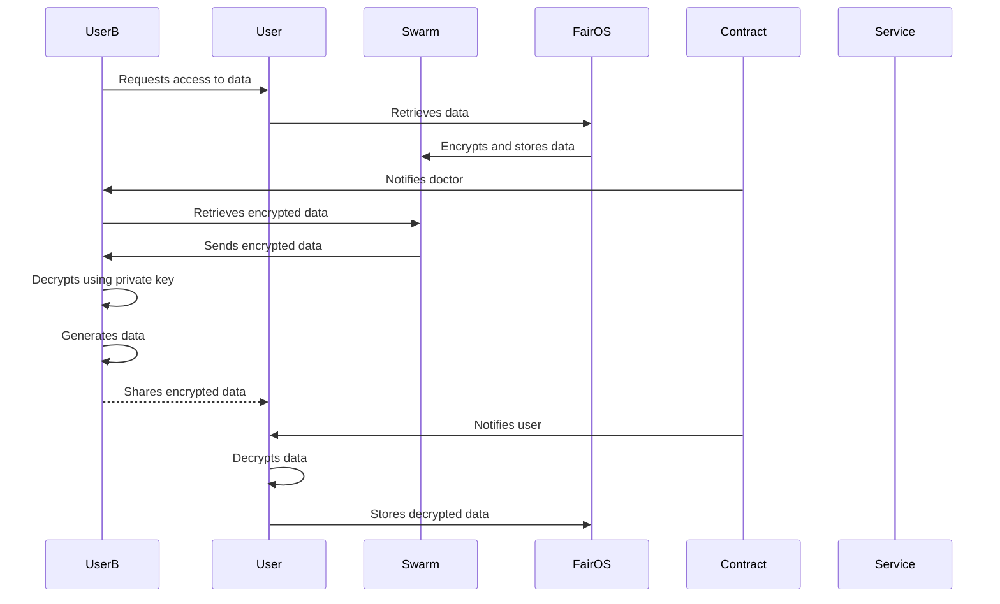
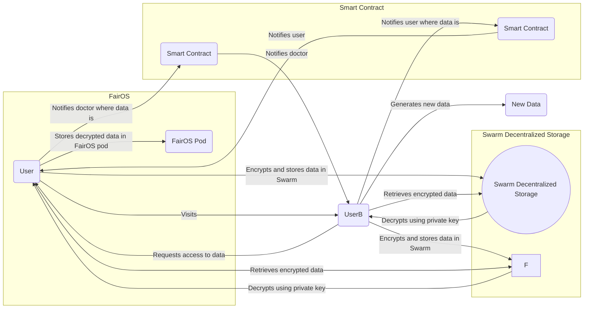

- FIP: TBD
- title: FairOS and Swarm Decentralized Storage Integration
- author: tx (@tfius)
- status: draft
- created: 20.7.2027

# Summary

This document outlines the process of integrating FairOS, a personal data space, with Swarm Decentralized Storage for secure storage and exchange of sensitive data. The integration is intended to be used in conjunction with standard for managing sensitive electronic records.

# FairOS and Swarm Decentralized Storage Integration

## Technologies

1. **FairOS**: FairOS is a personal data space where users store their personal data. Only the user can access the data or grant access to authorized services.

2. **Swarm Decentralized Storage**: Swarm is a decentralized storage system that allows secure storage of sensitive data in an encrypted form. It utilizes Diffie-Hellman Key Exchange for encryption and decryption.

3. **FairDataSociety ENS**: FairDataSociety ENS  provides a portable account for public key encryption. Users' public keys (x, y) are stored in the ENS.

** or ** 

4. **KeyNet**: KeyNet is a public key encryption register that facilitates secure encryption and decryption processes.

## Process Overview

The following steps describe the integration process, which involves a user, a doctor, and the storage and retrieval of encrypted data using FairOS and Swarm:

The UserB initiates the process by requesting access to the User's data.
The User retrieves the data from FairOS.
FairOS encrypts and stores the data in Swarm, a decentralized storage system.
The Contract component notifies the UserB about the availability of the encrypted data.
The UserB retrieves the encrypted data from Swarm.
Swarm sends the encrypted data to the UserB.
The UserB decrypts the data using their private key.
The UserB generates new data.
The UserB shares the newly encrypted data with the User.
The Contract component notifies the User about the encrypted data.
The User decrypts the data.
The User stores the decrypted data securely in FairOS.

The diagram illustrates the revised integration process:

### Improvements
To enhance the integration process, the following improvements could be considered:

**End-to-End Encryption**: Implement end-to-end encryption to ensure that data remains encrypted and secure throughout the entire process, including communication between the user and the doctor.

**Access Control Mechanisms**: Introduce more granular access control mechanisms within FairOS, allowing users to define specific permissions for different types of data and different entities (such as doctors) accessing their data.

**Audit Trail**: Implement an audit trail feature that records all access and modification activities performed on the data. This can enhance transparency and accountability in the system.

**Secure Key Management**: Ensure robust key management practices to protect the encryption keys used in the process. Consider using hardware security modules or other secure key storage mechanisms.

These improvements can further strengthen the security and privacy aspects of the integration between FairOS and Swarm Decentralized Storage.

This document provides an overview of the integration process, highlights the technologies involved, and proposes some improvements to enhance security and privacy. The Mermaid diagram visualizes the steps in the process.

Feel free to modify or add more details as per your requirements.

Please replace the placeholders with the actual values (e.g., @tfius, tfius, and 20.7. 2023).
