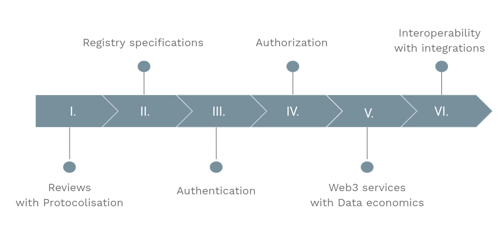
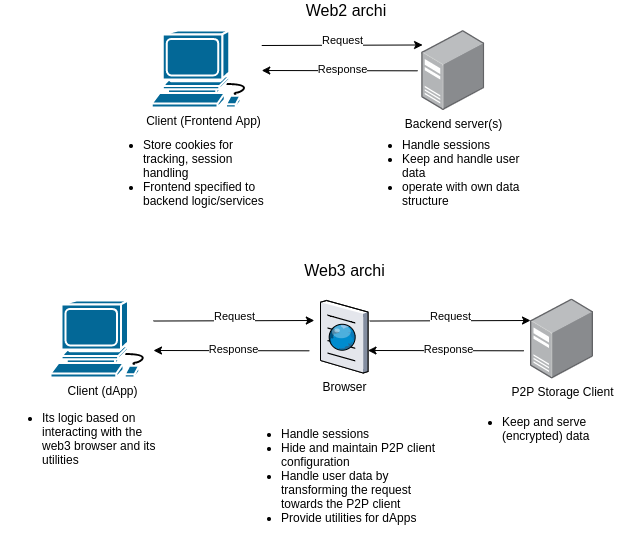
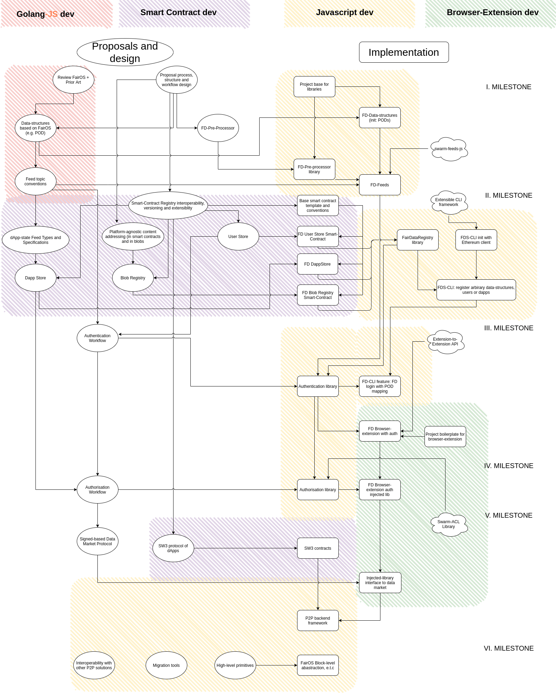

- FIP: (Number, to be assigned)
- title: FDP Roadmap
- author: Viktor Levente Tóth, @nugaon
- status: draft
- created: 2021-10-05

# Summary
<!-- One paragraph explanation of the feature/change. -->

A roadmap of the Fair Data Protocol for the upcoming developments and proposals.

# Context and motivation
<!-- Why are we doing this? What use cases does it support? What is the expected outcome? -->

The mission consists of
- creating a window into the underlying web3 filesystem,
- providing a web3 storage for dApps to connect to and use,
- organizing personal data and allowing access and cross-access to it,
- transforming data into information in a more global and reusable way than before.

The below presented plan aims at these principles and shows the main road to roll out the components needed to create a web3 ecosystem.

# Guide-level explanation
<!-- Explain the proposal as if it was already implemented, including:

- explain terms and concepts,
- explain features/ideas with examples,
- explain what kind of impact the proposal will have on other areas (e.g. other proposals)
-->

Web3 is decentralised and domainless, where the user posesses all their personal data, a continuation of the old web, but aligned with its original idea.
In order to facilitate creating decentralised applications (dApps), web3 primitives and common protocols have to be set and loaded.

The foundation of such an environment consists of
- commonly used data-structures, that gives opportunity dApps to interpret the produced data of another dApp; and also allows for users to easily transfer their data from one application to another,
- well defined Personal Data structure, that employes the protocolised data-structures and has a clear mapping to any particular data within the user-namespace,
- uniform addressing of resources such as users, dApps or content,
- instantly accessible global decentralised storage of users, dApps or data-structures, that only provides meta-information how to retrieve or interact with the entity in question,
- dApp environment and its workflow especially regarding to authentication, authorization and interaction with the personal data of users,
- web3 backend service architectures that substitue the serverside of web2 that aggregate on shared data and serve users in a reliable and flexible fashion.

Even though web3 has a great potential to emerge new use-cases and business modells, lack of these ingredients makes the implementation of dApps impossible or at least really slow, uneffective and cumbersome.

With the proposed components, it is possible to build full-featured web3 applications that can utilize data of another dApps and aggregate on it.
Because of this, new dApps might have a huge amount of data that they can start with.
For example, one dApp has data about a user who bought tickets for concerts and other dApp can make suggestions for listening new type of bands based on that - of course, if the user gives the permission to the dApp to read this personal data.

Also, it plants the seed for new type of data-economics, where the user can share their valuable data with dApps for service or monetisation, which is a great deal for both sides.
Here, it has to emphasized, the data in question is not binded to any real person and the shared data is well-boundered with a strict structure what it contains.

Nevertheless, the data that the user wants sell can be junk, but in a structure.
The data in Fair Data Protocol offered data-structures has content address that can be signed by dApps in case of the data is really valueable.
DApps have their own storage space that is similar to the user's, where they can put these signatures.

It creates a reputation-based data-market, where 
- users can obtain these signatures from the storage-space of dApps and resell their own data for other dApps.
- dApps can sell their user-interaction produced data for other dApps.

Many things are related to these points.
First, not all user-interaction produced data can be sold, because a big portion of that has to be readable by other users, therefore it is unencrypted.
On the other side, dApps have a trade-off about how much data they put into the common for reputation or just sell it.
The data in question can be a collection of user-public keys with the user's handled data-structures or else.
The reputation is good for incorporating with other dApps and can be an essential element of other dApps that based on that.
Eventually, it can yield a situation where dApps that share data the most will be the base layer of the web3 ecosystem and dApps built on those will be in the interest of keeping those alive. 
Moreover, the aggregation on reputation-friendly dApps is fully automatic, because of the globally accessible dApp registry that lists dApps with their dApp state.

Thereby, starting a dApp development will be more appealing than developing a web2 application, because
- new business-model/market which is flexible,
- commonly used data-structures provide interface between applications, and dApps have a huge advantage at start with the available public data.
- there is no single point of failure,
- automatic scaling,
- serverless,
- it is DDoS resiliante,
- cheaper to maintain than a cloud environment,
- and censorship-resistant.

For a user, the most appealing may be:
- having personal data,
- anonymity,
- generate income with internet-usage,
- global account and data handling accross dApps which 
  - encourage dApps to keep high quality and fair services that yield more convenient UX,
  - single sign on to the internet.

None of the milestones cab be fully finished, but they can provide usable libraries, executables, interfaces and ground base for other protocols and ideas.

# Reference-level explanation

Each implementation is preceded by a proposal.
The implementation has to be based on the consensus from the proposal.
The implementation programming language is JavaScript as one of the goal is synchronously alter data-structures and handle workflow on client-side.

## Milestones

The roadmap is sliced up to 6 milestones.

The first 5 are about creating a web3 ecosystem and utilizing the potential of Ethereum Swarm.
The last planned step is more about integrations with other P2P and web3 systems.

Each milestone has _products_ that implements the proposals of the milestone in question. 
When products are launched, it is a sign of preparation for the next milestone.
However, there are no problem areas that can be closed that the milestone targets, as these can be reconsidered later (such as the permitting workflow).
On the other hand, milestones can be completed when first versions of all planned _products_ have been released. 

### Milestone I. - Reviews with Protocolisation

Currently FairOS is the base connection point of FDS projects, but its components and logic can live in the application layer as well.
If the FairOS datastructures like PODs are defined on client-side, it allows freely manipulate it serverless.

In the first step, FairOS components and business-logic have to be _reviewed_ and translate them into JavaScript _modules_.

The required components of FairOS for the first milestone are:
- feeds topic conventions: how FairOS slices the user-namespace up, 
- POD data structure: iNode-like file representation,
- account handling: how the user profiles are handled in FairOS

Along with FairOS outsourcing, the general interpretation and structure of common datasets has to be considered as well.
For that, there are already existing solutions such as [JSON-LD](https://json-ld.org/), but the proposal that addresses this issue also can come up with own solution.
If the latter comes out first, the pre-processor should be really lightweight and be compatible with other pre-processors as well.
Create versioning frame of FDP
- UTF8-like version serialisation
- Data pre-processor

#### Products

- Proposals for data-structures and account handling
- FD pre-processor library
- FD feeds library that implements the feed conventions

### Milestone II. - Registry Specifications

Web3 applications handle users and data-structures in the same way, but such applications have to be able to reach some common database about it. 
Also, applications have to be registered somewhere in order to users find it.

These needs can be served out by smart contracts from blockchain. For that, the interface of these smart-contracts have to be defined and unified.

Smart contracts only store metadata about the entity that has to be interpreted one particular way that the proposals define.

Smart contract types to be addressed are:
- dApp Store: metadata about how user-agents can fetch the freshest application-state,
- user registry: basic username -> public key mapping that is used to perform Diffie-Hellman key exchanges and else,
- blob interface database: the public data-structures have to be available on demand as well, not only via proposals. 
Thereby, there are going to be fully supported data-structures that came out from proposals and arbitrary ones that dApp developers can registrate.

Some other dependencies and standards have to be tackled also such as:
- addressing specifications: how to address user/content/application in general (e.g. with CIDs)
- feed types: used feed alhorithm to pull application sate

#### Products

- Smart Contract interface definitions,
- Registry protocols: how to utilize metadata that stored in smart contracts,
- FairDataRegistry library,
  - based on that a CLI framework also is needed in order to register arbitrary structures, users or dApps.

### Milestone III. - Authentication

DApps should not handle directly any configuration of the user web3 services because they may compromite the login credentials. 
To prevent that, users need to log in to their user-agent instead of log in to dApps.
This solution offers Single-Sign-On that also makes the UX more convenient.
In order to create this user-agent login, a dedicated Fair Data Browser Extension has to be emerged, that keeps and handles all required configuration and credentials of the user and interacts and manages the personal-store-space of the user.

There are currently available solutions for handling dApp sessions like [swarm-extension](https://github.com/ethersphere/swarm-extension) with which the FD Extension could incorporate.

The desired outcomes of this browser extension are
- the user could save the session to their personal storage so that they are able to load it from another computer, 
- storing/retrieving any dApp saved data and manage personal data-space.

#### Products

- Authentication-library → for trusted sources
- FD browser-extension
- FD CLI (fairos-like app)

### Milestone IV. - Authorization

After the user can authenticate to its user-agent and dApps can call in an identifiable way the user-agent, 
the data-interaction between dApps and the user-agent has to be elaborated.

Users can allow for other dApps or users to read and write data in the user-namespace.
The data in question is encrypted by a key that both parties are aware of.
The encryption key of one particular dataset can be shared between many dApps, so the shared key handling will become a question in a long run.
ACLs are defined in the Book of Swarm that can be handy to store such a relationship between data and parties, but the key handling on participant removal (or at participant adding) is problematic.
When user revokes the permission from one participant to read, new encryption key has to be generated and dApps have to keep track about this change.
The same situation appears when the user adds one participant to read the data, but the user does not want to read the "history". 

Other parts related to this, of course, also have to be handled such as
- dApps request for personal storage usage: in a popup window the user is asked for giving permissions to the requested user-namespace
- verify data-structures on save that may require registry reads

#### Products

- Injected-library of FDS-extension
- Authorization-library
  - add/remove in ACL with supporting dApp resolution of encryption key changes

### Milestone V. - Web3 services with Data Economics

The dApp-user-namespace interaction at this point is sorted out, the only thing missing to fully replace web2 usage is the web3 backend services.

Web3 backend services are dApps too, so initiating the connection and make requests towards them has the same steps as fetching frontend dApps:
1. get meta-infromation of the dApp from the blockchain registry by its name
2. fetch the dapp state based on the acquired meta-information that contains the callable web3 service endpoints (e.g. PSS addresses) and the required request format.
3. send the request towards the actual web3 service.

These web3 services can be reliable by staking tokens on blockchain that the dApp can lose if it does not fulfill some promises.
This behavior can be achieved by changing Swap Swear and Swindle contract of Swarm in a way that the services become accountable for their produced feed updates or via specific Ethereum rollup mechanism.

Reliable services also can ask for compensation on service calls for their storage writing by requiring signed blockchain transaction from the user.

On a web3 service call, the user can share some user-data with the dApp in the required data-structure for monetisation or service.
For example, the user want to share their chest CT file with a dApp which tells whether it has some predictable disease or not, obviously the service is the compensation for their data.
Nevertheless, the user can ask for monetary compensation as well.
By calling the corresponding user-agent library method, the user can allow to share the key of the asked resource with the dApp.
Of course, the user data can be junk but in a structure so this use-case can be only viable if the user shares some feed of data with the dApp that will compensate at specific period of times.

Other case, when there is some evidence the user data is not junk.

When sharing data, dApps can sign the content address of the sent data if the information is valid and share this signature with the user.
By that, users can maintain a _proof of information_ next to their data-blobs that other dApps can automatically accept on data-sharing.
Eventually, it can cause a reputation-based data-market where dApps may raise the value of data in the user-namespace.
This whole will result a catalog in dApp feeds which describes the data-structure of encrypted content in which all content are valid.

In this phase, all message formats and web3 service call workflows can be protocolled along with the design of a web3 service framework. 
Top on that, the injected library and browser-extension logic have to be placed to negotiate such data-market deals.

#### Products

- P2P backend service framework
- SW3 smart contracts → accountability of web3 services
- Signed-based data market protocol
- Injected-library interface to data market

### Milestone VI. - Interoperability with integrations

The last milestone opens the gates for other uncountable developments and products, because it utilizes all described components above.

One of the goal here is to make the whole dApp web3 environment platform-agnostic.
FairOS has the block-type abstraction that can be reconsidered here how it can abstract away the 4KB chunking of Bee client and make a framework that provides the same storage interface regardless it is backed up by Ethereum Swarm or IPFS.

Integration projects with already existing projects are encouraged here, e.g. producing P2P storage drivers for databases.

Producing higher level primitives and improving the already existing frameworks and libraries is a never ending task from this point where new needs arise continuously as the ecosystem grows.

Nevertheless, there is a need for a platform which groups all web3 features above in a form of a web3 browser - but it is not the scope of this roadmap.

## Roadmap flowchart

The flowchart is devided into two components: _Proposal and design_ and _Implementation_.
The proposals precede the implementations though those can happen simultaneously.

The arrows between the nodes only indicate what follows what and do not represent dependency.

The time estimates below are optimistic and only show how long it will take to produce something from the task.

# Drawbacks
The design is similar to a waterfall-like project plan, but it allows the implementation and the design part to be in iteration. 

# Rationale and alternatives
Fair Data Society projects need frameworks in order to utilize the power of web3.

Because of that, the roadmap addressed the problem areas of:
- DApps do not have a proper web3 environment in browser level in which they can work,
- common data structures that are well defined and easy to use,
- web3 backend services,
- data economics,
- blockchain entity registries.

# Prior art

# Unresolved questions

# Future possibilities

This proposal affects most of the subsequent proposals.
Of course, there is opportunity to diverge and satisfy other needs in certain level and cases until its last milestone, 
but those ideas can be postponed and deprioritised referring to this document.

## Copyright

Copyright and related rights waived via [CC0](https://creativecommons.org/publicdomain/zero/1.0/).
